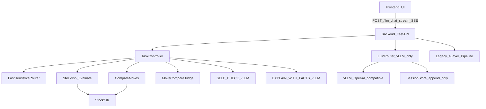

## Chess-GPT Pipeline (vLLM + Cursor-like Controller)

This document describes the current end-to-end pipeline: **frontend → backend SSE → controller/legacy orchestration → Stockfish/tools → vLLM → response**, including sessions, event streaming, and debugging knobs.

### High-level architecture

### Key entrypoints

- **Streaming chat (main UI)**: `POST /llm_chat_stream` (SSE)
  - Chooses **TaskController** when `USE_TASK_CONTROLLER=true`
  - Falls back to **legacy pipeline** if controller throws
- **Non-streaming chat**: `POST /llm_chat`
  - Default path is router-only (no legacy tool calling) unless `ENABLE_LEGACY_TOOL_CALLING=true`

### Provider model: vLLM-only

All LLM calls flow through `LLMRouter` and default to **provider=vllm**.

- `VLLM_ONLY=true` (default) hard-disables external providers.
- vLLM endpoint/config:
  - `VLLM_BASE_URL` (default is the RunPod proxy URL)
  - `VLLM_MODEL` (default `/workspace/models/qwen2.5-32b-awq`)

The router logs each completion with:
- stage, provider, model id, session key, prompt prefix chars, user chars, output chars, TTFT/total time, token usage if available.

### Sessions and prefix caching

The system is designed for vLLM KV-cache reuse:
- **Stable prefix**: minimal SYSTEM prompt + deterministic task seed
- **Append-only transcript**: never rewrite prior tokens
- **Task primary keying**:
  - `task_id` is preferred and should be stable per user thread/tab
  - `session_id` is supported (tab-scoped) when `task_id` is absent

Session keys are `"{task_id}:{subsession}"`.

Conventions:
- `subsession="main"`: user-visible transcript
- other subsessions: internal work streams (`self_check`, etc.)

### Session Brain persistence (Redis)

By default, the backend uses an in-process `InMemorySessionStore` (fast, but resets on restart).

To persist sessions across backend restarts and support multiple concurrent users while keeping
**append-only prefix caching** semantics, enable Redis:

- `SESSION_STORE=redis`
- `REDIS_URL=redis://localhost:6379/0`
- `SESSION_TTL_SECONDS=3600`
- `SESSION_MAX_CONTEXT_CHARS=250000`

Notes:

- Session keys are `"{task_id}:{subsession}"`.
- The store enforces **system_prompt immutability** and **seed_prefix set-once** to protect vLLM KV-cache reuse.
- If Redis is misconfigured/unavailable, the backend logs a warning and falls back to in-memory.

### Controller path (Cursor-like)

When enabled (`USE_TASK_CONTROLLER=true`), the controller runs a deterministic loop:

1. **Fast router** (zero-token)
   - Handles only safe deterministic cases (example: castling legality checks)
2. **Interpreter** (vLLM JSON command)
   - Classifies intent and whether investigation is required
3. **Engine evaluation (light)** (Stockfish)
   - Uses the in-process “temporary board” evaluation that returns:
     - `eval_cp` (white POV)
     - `top_moves` (ranked, with evals/PV)
4. **Cursor loop** (engine-first candidate selection)
   - Controlled by:
     - `ENABLE_CURSOR_LOOP=true`
     - `ENABLE_CURSOR_LOOP_COMPARE=true`
     - `CURSOR_LOOP_TOPN` (default 5, max 8)
     - `CURSOR_LOOP_COMPARE_TOPN` (default 3)
     - `CURSOR_LOOP_COMPARE_DEPTH` (default `COMPARE_DEPTH`)
   - If the message asks for move suggestions (“what do I do / next move / progress / best move…”):
     - pick candidates from `top_moves`
     - optionally compare/judge them deterministically
     - emit `facts_ready` SSE event before prose
5. **Self-check** (vLLM JSON command)
   - Determines whether to stop, missing artifacts, and confidence
   - Stop rule knob: `STOP_CONFIDENCE_THRESHOLD` (default 0.72)
6. **Explanation** (vLLM prose)
   - `EXPLAIN_WITH_FACTS` contract: **must not invent moves**; only recommend moves present in `facts.top_moves` / `facts.move_compare`.
7. **Memory compression** (best-effort)
   - Summarizes and stores a small “task memory” card for continuity

### Legacy pipeline path (4-layer)

The legacy pipeline remains for compatibility and is used when:
- `USE_TASK_CONTROLLER=false`, or
- controller throws an exception and the SSE handler falls through.

Conceptually:
- Interpreter → Planner → Executor/Investigator → Summariser → Explainer
- Emits additional SSE events (plan/step updates, summariser/explainer streaming chunks, etc.)

### Engine and “temporary board” tools

The backend exposes board/engine endpoints intended for isolation and determinism:

- `POST /board/analyze`: eval + `top_moves` sized by `multipv`
- `POST /board/apply_line`: apply SAN/UCI moves to a FEN safely
- `POST /board/compare_moves`: compare a list of candidate moves from a FEN
- `POST /board/scan_d2_d16`: bounded D2/D16 scan (optional)
- `POST /board/pgn_from_exploration`: PGN generation from exploration tree

These endpoints are gated by env flags:
- `ENABLE_BOARD_ENDPOINTS=true`
- `ENABLE_SCAN_ENDPOINTS=true`

### SSE event types (frontend listens to these)

Core:
- `milestone` (task/controller progress)
- `status` (phase + message)
- `facts_ready` (controller facts commit before prose)
- `complete` (final response payload)
- `error`

Legacy pipeline extras:
- `plan_created`, `step_update`, `thinking_started`, `plan_progress`, `pgn_update`, `board_state`
- `summariser_start`, `summariser_progress`, `summariser_claim_chunk`, `summariser_done`
- `explainer_start`, `explainer_progress`, `explainer_prompt_audit`, `explainer_chunk`, `explainer_done`

### Observability and debugging

Recommended knobs:
- `LLM_ROUTER_LOG_CALLS=true` (default) to see vLLM call summaries (TTFT, total time, prefix size)
- `VLLM_HEALTH_TTL_SECONDS` to tune health probe caching
- `TASK_MAX_TIME_S` global controller time budget (default 18s)
- `BOARD_CACHE_TTL_S` cache TTL for `/board/analyze`

Health endpoints:
- `GET /health`
- `GET /health/vllm` (if present in your build; used for diagnostics)

### Common failure modes and what to check

- **Controller falls back to legacy**: check backend logs for `⚠️ [TASK_CONTROLLER] Failed...` then fix root cause.
- **vLLM not used**: ensure `VLLM_ONLY=true` and router logs show `provider=vllm`.
- **Slow first token (TTFT)**: check router log `ttft_ms`, ensure stable `task_id`, avoid changing system/task_seed.
- **PGN build asserts**: PGN generation should never crash; legality checks and safe SAN are required.

### “Correctness-first” contract (non-negotiable)

Any prose stage must follow:
- Do not claim evals/PVs unless present in facts.
- Do not recommend a move unless it appears in `top_moves` or `move_compare` facts.

