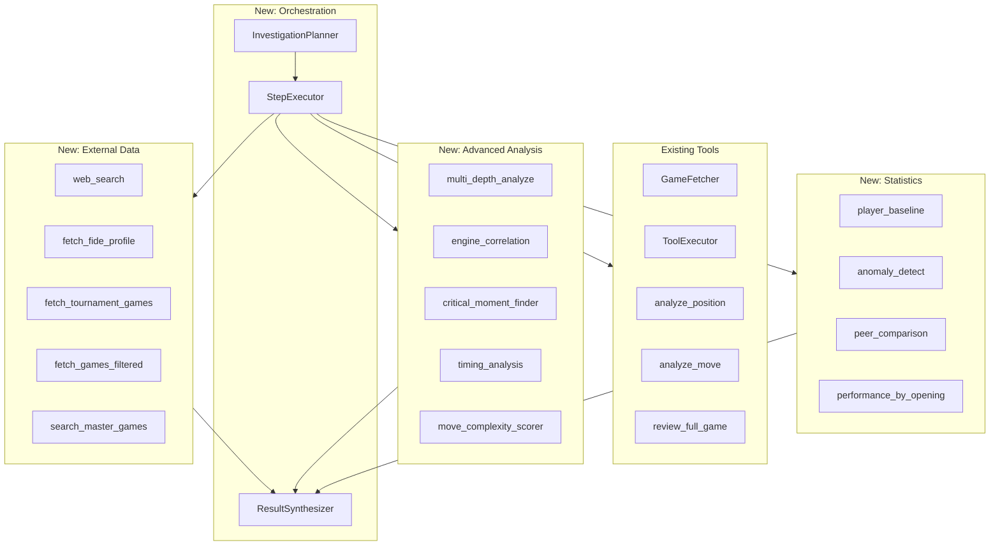

# Advanced Intelligence Tools Plan

Comprehensive tool system for complex multi-step reasoning including cheating investigations, player research, and anomaly detection. Builds on existing `game_fetcher.py` and `tool_executor.py`.

## Architecture Overview



## Implemented Files

| File | Description | Status |
|------|-------------|--------|
| `backend/tools/web_search.py` | Web search via Tavily API | Done |
| `backend/tools/multi_depth_analysis.py` | Multi-depth game analysis | Done |
| `backend/tools/engine_correlation.py` | Engine move correlation | Done |
| `backend/tools/anomaly_detection.py` | Statistical anomaly detection | Done |
| `backend/tools/player_baseline.py` | Calculate player baselines | Done |
| `backend/tools/critical_moments.py` | Find turning points | Done |
| `backend/tools/complexity_scorer.py` | Move complexity scoring | Done |
| `backend/tools/game_filters.py` | Advanced game filtering | Done |
| `backend/tools/peer_comparison.py` | Compare to rating peers | Done |
| `backend/planning_agent.py` | LLM-based investigation planner | Done |
| `backend/step_executor.py` | Plan execution engine | Done |
| `backend/result_synthesizer.py` | Combine findings into reports | Done |
| `backend/investigation_types.py` | Types, configs, benchmarks | Done |

## API Requirements

| Service | Cost | Purpose |
|---------|------|---------|
| Tavily API | $5-50/mo | Web search |
| Chess.com API | Free | Games, profiles (rate limited) |
| Lichess API | Free | Games, broadcasts, opening explorer |
| FIDE (scrape) | Free | Official ratings |

## Example: Cheating Investigation Flow

```
User: "Did Hans Niemann cheat at the Sinquefield Cup?"

1. InvestigationPlanner creates:
   Step 1: web_search("Hans Niemann Sinquefield Cup cheating")
   Step 2: fetch_tournament_games("Hans Niemann", "Sinquefield Cup", 2022)
   Step 3: fetch_games_filtered(username="hansniemann", date_from="2022-01", date_to="2022-08")
   Step 4: calculate_baseline($step_3.games)
   Step 5: multi_depth_analyze($step_2.games, depths=[15, 25, 40])
   Step 6: engine_correlation($step_2.games, depth=30)
   Step 7: detect_anomalies($step_2.games, $step_4.baseline)
   Step 8: compare_to_peers($step_7.metrics, "2650-2750")

2. StepExecutor runs all steps, resolving dependencies

3. ResultSynthesizer combines findings into balanced report
```

### To-dos

- [x] Locate Stockfish source path in repo
- [x] Add UCI flags and dumping hooks to Stockfish
- [x] Implement per-piece masking command
- [x] Build Python loaders and attribution modules
- [x] Add CLI and HTTP API for analyze/dump
- [x] Write architecture and format docs
- [x] Create external data tools (web_search, game_filters)
- [x] Implement multi_depth_analyze, engine_correlation, anomaly_detect
- [x] Build player_baseline, calculate_baseline, peer_comparison tools
- [x] Create critical_moments and complexity_scorer tools
- [x] Create InvestigationPlanner for multi-step complex queries
- [x] Build StepExecutor for executing investigation plans
- [x] Create ResultSynthesizer for combining findings
- [x] Define investigation_types and rating benchmarks
- [ ] Add TAVILY_API_KEY to .env for web search
- [x] Integrate investigation tools with main ToolExecutor
- [x] Add "investigate" tool to chat_tools.py
- [x] Add formatters for investigation results in ToolExecutor
- [ ] Update interpreter prompt with investigation guidance
- [ ] Add P2 tools: master_games, timing_analysis, opening_performance

---

## Internal Chain-of-Thought / Status Messages

Add visible status messages so users can see the system's intent, tool calls, and progress.

### Status Message Implementation

| File | Status | Description |
|------|--------|-------------|
| `backend/orchestration_plan.py` | ✅ | Enhanced StatusMessage with tool, progress, timestamp |
| `backend/request_interpreter.py` | ✅ | Added status_callback to interpret() |
| `backend/step_executor.py` | ✅ | Added TOOL_MESSAGES and enhanced status updates |
| `backend/main.py` | ✅ | Added status collection and response fields |
| `frontend/components/StatusIndicator.tsx` | ✅ | Created - live status with spinner |
| `frontend/components/IntentBox.tsx` | ✅ | Created - shows intent and tools used |
| `frontend/components/Conversation.tsx` | ✅ | Integrated IntentBox for assistant messages |
| `frontend/app/page.tsx` | ✅ | Added status tracking state and imports |

### Response Fields Added

```json
{
  "content": "...",
  "status_messages": [
    {"phase": "interpreting", "message": "Understanding your request...", "timestamp": 1234567890},
    {"phase": "planning", "message": "Detected: cheating investigation", "timestamp": 1234567891},
    {"phase": "executing", "message": "Searching the web...", "tool": "web_search", "timestamp": 1234567892}
  ],
  "detected_intent": "Cheating investigation for Hans Niemann",
  "tools_used": ["web_search", "multi_depth_analyze", "engine_correlation"]
}
```

### Status To-dos

- [x] Add status_history collection to /llm_chat endpoint
- [x] Add status_callback to RequestInterpreter.interpret()
- [x] Enhance StepExecutor with tool-specific status messages
- [x] Create StatusIndicator component with live spinner
- [x] Create IntentBox component for showing detected intent
- [x] Integrate status display into Conversation component

